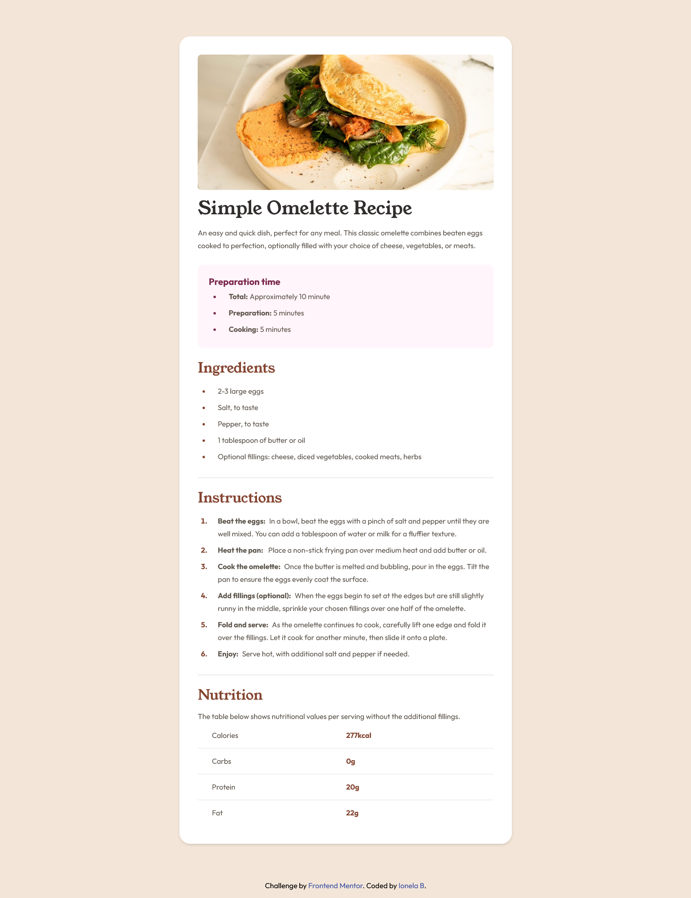

# Frontend Mentor - Recipe page solution

This is a solution to the [Recipe page challenge on Frontend Mentor](https://www.frontendmentor.io/challenges/recipe-page-KiTsR8QQKm). Frontend Mentor challenges help you improve your coding skills by building realistic projects.

## Table of contents

- [Overview](#overview)
  - [The challenge](#the-challenge)
  - [Screenshot](#screenshot)
  - [Links](#links)
- [My process](#my-process)
  - [Built with](#built-with)

## Overview

### Screenshot



### Links

- Solution URL: [Add solution URL here]
- Live Site URL: [https://ionela1604.github.io/recipe-page]

## My process

### Built with

- Semantic HTML5 markup
- CSS custom properties
- [Tailwind CSS](https://tailwindcss.com/docs/installation)

### What I learned

I learned how to use Tailwind CSS and it was pretty easy to understand. It has a well-defined documentation.

```html
<h2>Ingredients</h2>
<ul class="list-disc ingredients">
  <li>
    <div class="bullet">2-3 large eggs</div>
  </li>
  <li>
    <div class="bullet">Salt, to taste</div>
  </li>
  <li>
    <div class="bullet">Pepper, to taste</div>
  </li>
  <li>
    <div class="bullet">1 tablespoon of butter or oil</div>
  </li>
  <li>
    <div class="bullet">
      Optional fillings: cheese, diced vegetables, cooked meats, herbs
    </div>
  </li>
</ul>
```

```css
h2 {
  @apply font-youngserif font-normal text-[30px] text-nutmegColor mt-8 mb-5;
}

.ingredients li {
  @apply text-wengeBrownColor marker:text-nutmegColor;
}

ul li .bullet {
  @apply ml-5;
}
```
